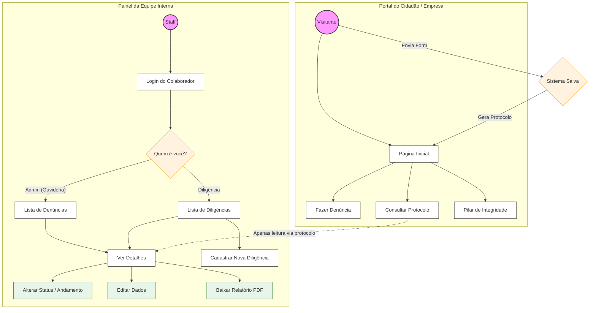

# Rails_Compliance_System
**Sistema de compliance para a empresa _ISM GOMES DE MATTOS_**

- [Rails\_Compliance\_System](#rails_compliance_system)
  - [Descrição.](#descrição)
  - [Entregáveis.](#entregáveis)
  - [Backend.](#backend)
  - [Front-End.](#front-end)
  - [Arquitetura de Segurança](#arquitetura-de-segurança)
    - [Fluxo de Interações](#fluxo-de-interações)
  - [Matriz de Controle de Acesso (RBAC)](#matriz-de-controle-de-acesso-rbac)
  - [Camadas de Implementação Técnica](#camadas-de-implementação-técnica)
    - [Escopo de Busca (Proteção contra IDOR)](#escopo-de-busca-proteção-contra-idor)
    - [Autorização Atômica](#autorização-atômica)
    - [Filtro de Parâmetros por Perfil (Mass Assignment)](#filtro-de-parâmetros-por-perfil-mass-assignment)
    - [Ofuscação de Identificadores](#ofuscação-de-identificadores)
  - [Protocolo de Validação (QA)](#protocolo-de-validação-qa)
    - [Isolamento de Perfil](#isolamento-de-perfil)
    - [Integridade de Status](#integridade-de-status)
    - [Privacidade de Detalhes](#privacidade-de-detalhes)

## Descrição.
Desenvolver a infraestrutura lógica (Back-end) para o Canal de Denúncias da ISM
Alimentação. O sistema será responsável por receber os dados do front-end existente,
garantir a segurança das informações e disponibilizar um Painel Administrativo para a
gestão das denúncias.

## Entregáveis.

- Recepção de Denúncia: Rota segura para recebimento de dados e
provas/evidências.
- Geração de Protocolo: Criação automática de um código único e anônimo para
acompanhamento do caso.
- Consulta de Status: Endpoint para verificação do andamento via protocolo.
- Interface: Desenvolvimento da interface de input e do Painel Administrativo.
- Segurança : Autenticação e autorização de usuários, conformidade com a LGPD e
proteção contra ataques web comuns.

## Backend.

**Ruby on Rails**

**Postgre SQL**

## Front-End.

**HTML**

**CSS**

**JavaScript**

**Flexbox**

**React**

## Arquitetura de Segurança

O sistema adota o modelo de **Defesa em Profundidade** para garantir a integridade dos dados e o isolamento de informações sensíveis, conforme ilustrado no fluxo de interações abaixo.

---

### Fluxo de Interações

---

## Matriz de Controle de Acesso (RBAC)

| Perfil     | Acesso Ouvidoria | Acesso Diligência | Visualização (`show`)        | Ações de Escrita              |
|------------|------------------|-------------------|------------------------------|-------------------------------|
| Visitante  | Não              | Não               | Não (apenas status)          | Não                           |
| Diligência | Não              | Sim               | Sim (apenas diligência)      | Sim (apenas diligência)       |
| Admin      | Sim              | Sim               | Sim                          | Sim                           |

## Camadas de Implementação Técnica

### Escopo de Busca (Proteção contra IDOR)

O método `set_authorized_report` restringe a busca no banco de dados com base na sessão ativa:

- **Admin**: acesso total via `Report.all`
- **Analista de Diligência**: acesso limitado a registros onde `razao_social` não é nulo
- **Visitante**: bloqueio total de acesso direto por ID

Tentativas de acesso fora do escopo resultam em erro `ActiveRecord::RecordNotFound`, prevenindo enumeração de registros e exposição indevida de dados.

---

### Autorização Atômica

Ações críticas, incluindo `update_status` e `destroy`, possuem validações de perfil internas ao método.

Isso assegura que a autorização seja verificada no momento da execução, independentemente de verificações de rotas globais ou manipulações de interface.

---

### Filtro de Parâmetros por Perfil (Mass Assignment)

O método `filtered_report_params` implementa permissões dinâmicas de atributos:

- **Gestão (Admin)**: acesso integral aos atributos do modelo
- **Público (Visitante)**: permissão restrita exclusivamente aos campos de entrada do relato

Essa camada impede a modificação de metadados administrativos (como `status`) via injeção de parâmetros no cliente.

---

### Ofuscação de Identificadores

A identificação pública de relatos utiliza protocolos gerados via `SecureRandom`, no formato:

    CD-XXXX-XXXX

O uso de identificadores não sequenciais e de alta entropia elimina o risco de descoberta de registros por força bruta ou predição de IDs incrementais.

---

## Protocolo de Validação (QA)

### Isolamento de Perfil
Validar que Analistas de Diligência recebem erro **404** ao tentar acessar IDs de relatos de Ouvidoria.

### Integridade de Status
Confirmar que envios via formulário público **não alteram** o campo `status` original por interceptação de requisições.

### Privacidade de Detalhes
Garantir que usuários não autenticados sejam redirecionados ao tentar acessar a rota `show` por manipulação direta da URL.

